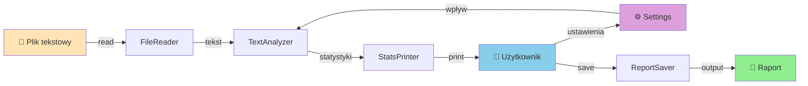
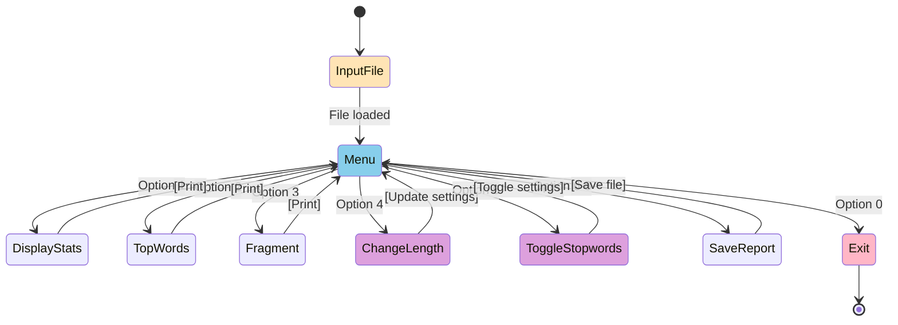
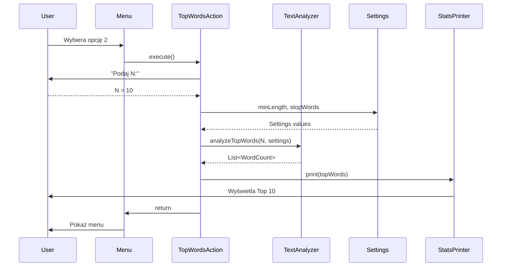
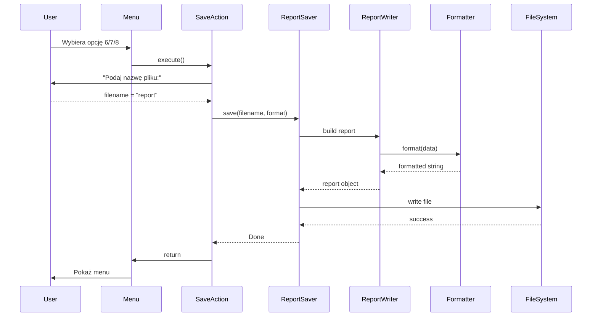

# Diagramy UX - Zaawansowane

## 1. Diagram przepływu danych (Data Flow)



---

## 2. Diagram stanu aplikacji



---

## 3. Diagram sekwencji - Top N Słów



---

## 4. Diagram sekwencji - Zapis Raportu



---

## 5. Diagram przypadków użycia (Use Cases)

```mermaid
actor User
participant TextAnalyzer
participant Menu

User-->TextAnalyzer: Load Text File
User-->Menu: View Statistics
User-->Menu: View Top Words
User-->Menu: View Word Frequency
User-->Menu: Configure Settings
User-->Menu: Save Report
User-->Menu: Exit

TextAnalyzer-->Menu: Analyze Text
Menu-->User: Display Results
```

Alternatywnie ASCII:

```
┌─────────────────────────────────────┐
│         SYSTEM: Text Analyzer       │
└─────────────────────────────────────┘
            /       |       \
           /        |        \
          /         |         \
    [User]         [System]   [Files]
     / | \          / | \      / | \
    /  |  \        /  |  \    /  |  \
   1   2   3      4   5   6  7   8   9
   
Use Cases:
1. Load File
2. View Stats
3. Configure Settings
4. Analyze Text
5. Sort Words
6. Filter by Length
7. Save to CSV
8. Save to JSON
9. Save to XML
```

---

## 6. Diagram klasyfikacji funkcjonalności

```
Text Analyzer
│
├── 📊 Analiza tekstu (Read-Only)
│   ├── Statystyki podstawowe
│   ├── Liczenie słów
│   ├── Top N słów
│   └── Częstość w fragmencie
│
├── ⚙️ Konfiguracja (Settings)
│   ├── Zmiana min. długości słowa
│   └── Toggle stop-words
│
└── 💾 Eksport danych
    ├── Raport Basic (TXT)
    ├── Raport Full (Multi-format)
    └── Raport Frequency (CSV/JSON/XML)
```

---

## 7. Mapa navigacji - Dokładnie

```
                    ┌─────────────────┐
                    │  SCREEN: Input  │
                    │  Filename       │
                    └────────┬────────┘
                             │
                    ┌────────▼────────┐
                    │ SCREEN: Main    │
                    │ Menu Loop       │
                    └────────┬────────┘
        ┌───────────────────┼───────────────────┐
        │                   │                   │
        │                   │                   │
        │                   │                   │
   ┌────▼────┐      ┌──────▼──────┐     ┌─────▼─────┐
   │Analysis │      │ Settings    │     │   Save    │
   │Screens  │      │ Change      │     │  Report   │
   └────┬────┘      └──────┬──────┘     └─────┬─────┘
        │                   │                   │
   ┌────▼─────────────────────────────────────▼───┐
   │    SCREEN: Main Menu (Back Loop)             │
   └──────────────────────────────────────────────┘
```

---

## 8. Komponenty UI i ich role

```
┌──────────────────────────────────────────┐
│          UI Components                   │
├──────────────────────────────────────────┤
│                                          │
│ [UserInput]                              │
│  └─ readLine() : String                  │
│     Role: Pobieranie danych od użytkownika
│                                          │
│ [StatsPrinter]                           │
│  └─ print(stats) : void                  │
│     Role: Wyświetlanie wyników           │
│                                          │
│ [ReportSaver]                            │
│  └─ save(path, format, stats) : void     │
│     Role: Zapis raportów do pliku        │
│                                          │
│ [TextMenu]                               │
│  └─ run() : void                         │
│     Role: Główna pętla menu              │
│                                          │
└──────────────────────────────────────────┘
```

---

## 9. Journey Map - Typowy użytkownik

```
┌─────────────────────────────────────────────────────────┐
│ Faza 1: Initialization                                  │
├─────────────────────────────────────────────────────────┤
│ Akcja:        Uruchomienie aplikacji                    │
│ Input:        Nazwa pliku                              │
│ Emocja:       😐 Neutralna                              │
│ Ból:          -                                         │
│ Zysk:         Załadowanie danych                        │
└─────────────────────────────────────────────────────────┘

┌─────────────────────────────────────────────────────────┐
│ Faza 2: Exploracja                                      │
├─────────────────────────────────────────────────────────┤
│ Akcja:        Przeglądanie opcji menu                   │
│ Input:        Numeracja opcji                          │
│ Emocja:       😊 Zainteresowana                         │
│ Bol:          Brak jasnych wskazówek dla każdej opcji   │
│ Zysk:         Poznanie możliwości                       │
└─────────────────────────────────────────────────────────┘

┌─────────────────────────────────────────────────────────┐
│ Faza 3: Analiza                                         │
├─────────────────────────────────────────────────────────┤
│ Akcja:        Wykonywanie operacji analitycznych        │
│ Input:        Różne parametry (N, fragment, etc)        │
│ Emocja:       😄 Zadowolona                             │
│ Bol:          Brak walidacji parametrów                 │
│ Zysk:         Uzyskanie wyników analitycznych           │
└─────────────────────────────────────────────────────────┘

┌─────────────────────────────────────────────────────────┐
│ Faza 4: Konfiguracja                                    │
├─────────────────────────────────────────────────────────┤
│ Akcja:        Zmiana ustawień (długość, stop-words)     │
│ Input:        Nowe wartości                             │
│ Emocja:       😊 Zainteresowana                         │
│ Bol:          Brak informacji o obecnych ustawieniach   │
│ Zysk:         Dostosowanie do swoich potrzeb            │
└─────────────────────────────────────────────────────────┘

┌─────────────────────────────────────────────────────────┐
│ Faza 5: Export                                          │
├─────────────────────────────────────────────────────────┤
│ Akcja:        Zapisywanie raportów                      │
│ Input:        Nazwa pliku, format                       │
│ Emocja:       😊 Zadowolona                             │
│ Bol:          Brak informacji o formacie               │
│ Zysk:         Raport do dalszego użytku                 │
└─────────────────────────────────────────────────────────┘

┌─────────────────────────────────────────────────────────┐
│ Faza 6: Zakończenie                                     │
├─────────────────────────────────────────────────────────┤
│ Akcja:        Wyjście z aplikacji                       │
│ Input:        Wybór opcji 0                             │
│ Emocja:       😊 Zadowolona                             │
│ Bol:          -                                         │
│ Zysk:         Zakończenie sesji                         │
└─────────────────────────────────────────────────────────┘
```

---

## 10. Wireframe - Main Menu

```
╔════════════════════════════════════╗
║      TEXT ANALYZER v1.0            ║
║  File: document.txt (loaded)       ║
╠════════════════════════════════════╣
║                                    ║
║  === MAIN MENU ===                 ║
║                                    ║
║  1. 📊 Basic Statistics            ║
║  2. 📈 Top N Words                 ║
║  3. 🔍 Frequency in Fragment       ║
║  ────────────────────────          ║
║  4. ⚙️  Min Word Length             ║
║  5. 🚫 Toggle Stop-Words           ║
║  ────────────────────────          ║
║  6. 💾 Save Basic Report           ║
║  7. 💾 Save Full Report            ║
║  8. 💾 Save Frequency Report       ║
║  ────────────────────────          ║
║  0. ❌ Exit                         ║
║                                    ║
║  Please select an option: [_]      ║
║                                    ║
╠════════════════════════════════════╣
║  Status: Ready                     ║
╚════════════════════════════════════╝
```

---

## 11. Wireframe - Top Words Screen

```
╔════════════════════════════════════╗
║      TEXT ANALYZER v1.0            ║
║  Screen: Top N Words               ║
╠════════════════════════════════════╣
║                                    ║
║  How many top words? [__]          ║
║                                    ║
║  Current Settings:                 ║
║  • Min Word Length: 3              ║
║  • Stop-Words: ENABLED             ║
║                                    ║
║  ════════════════════════          ║
║  TOP 10 WORDS:                     ║
║  ════════════════════════          ║
║                                    ║
║  1. analyzed      ▓▓▓▓▓ 45         ║
║  2. important    ▓▓▓▓ 38           ║
║  3. frequency    ▓▓▓ 32            ║
║  4. results      ▓▓▓ 29            ║
║  5. system       ▓▓ 25             ║
║  6. process      ▓▓ 22             ║
║  7. algorithm    ▓▓ 19             ║
║  8. optimization ▓ 16              ║
║  9. function     ▓ 14              ║
║  10. efficiency  ▓ 12              ║
║                                    ║
║  Press ENTER to continue...        ║
║                                    ║
╠════════════════════════════════════╣
║  Status: Results displayed         ║
╚════════════════════════════════════╝
```

---

## 12. Interakcje - Co się dzieje za kulisami

```
┌─────────────────────────────────────────┐
│ USER SELECT "2. TOP WORDS"              │
└─────────────────────────────────────────┘
                    │
                    ▼
┌─────────────────────────────────────────┐
│ TopWordsAction.execute() wywoływana     │
└─────────────────────────────────────────┘
                    │
       ┌────────────┼────────────┐
       │            │            │
       ▼            ▼            ▼
  [Input]     [Settings]  [TextAnalyzer]
  "Podaj N"   minLength:3  analyzeTopWords()
              stopWords    │
              :true        │ Filtrowanie
              │            │ Sortowanie
              │            │ Liczenie
              │            │
              └────────────┼────────────┘
                           │
                           ▼
                    [Result List]
                    WordCount[]
                           │
                           ▼
                    [StatsPrinter]
                    print() to stdout
                           │
                           ▼
                    [Return to Menu]
```

---

## 13. Mapa ciepła - Częstość używania opcji (prognoza)

```
┌──────────────────────┐
│   Opcja  │ Użycie    │
├──────────────────────┤
│ 1        │ ████████░ │ 80% (Częsty)
│ 2        │ █████░░░░ │ 50% (Średni)
│ 3        │ ███░░░░░░ │ 30% (Rzadki)
│ 4        │ ██░░░░░░░ │ 20% (Rzadki)
│ 5        │ ███░░░░░░ │ 30% (Rzadki)
│ 6        │ ████░░░░░ │ 40% (Średni)
│ 7        │ ███░░░░░░ │ 30% (Rzadki)
│ 8        │ ████░░░░░ │ 40% (Średni)
│ 0        │ ██████░░░ │ 60% (Średni)
└──────────────────────┘
```

Legend: ████ = High Usage, ░░░░ = Low Usage

